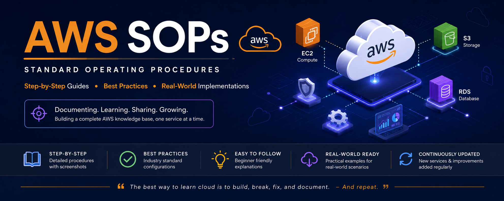

# AWS SOPs ☁️

<p align="center">
  
</p>

[](https://aws.amazon.com/)


[](https://github.com/Tarang2604/AWS-SOPs)

A collection of AWS Standard Operating Procedures (SOPs) created during my cloud learning journey.

This repository serves as a personal cloud knowledge base containing step-by-step implementation guides, screenshots, configurations, and revision notes for AWS services.

---

## 🎯 Repository Objectives

* Document AWS implementations in a structured format
* Build a personal cloud reference library
* Create revision material for interviews and certifications
* Share practical AWS learning resources with the community
* Develop documentation and troubleshooting skills

---

## 📚 Available SOPs

### 🖥️ Amazon EC2

* EC2 Instance Creation
* EBS Volumes
* EBS Snapshots
* Basic Configuration and Management

### 📦 Amazon S3

* Bucket Creation
* Object Management
* Storage Configuration
* Access Management

### 🗄️ Amazon RDS

* Database Creation
* Instance Configuration
* Connectivity Setup
* Storage and Monitoring Configuration

### 📊 Amazon CloudWatch

* CloudWatch Metrics
* CloudWatch Logs
* CloudWatch Alarms
* CloudWatch Dashboards
* Monitoring Best Practices

---

## 🚀 Upcoming SOPs

* IAM (Identity and Access Management)
* VPC (Virtual Private Cloud)
* Route 53
* CloudFront
* Elastic Load Balancer (ELB)
* Auto Scaling
* AWS Lambda
* ECS
* EKS
* Terraform on AWS

---

## 🛠️ Technologies Covered

* Amazon Web Services (AWS)
* Linux
* Networking Fundamentals
* Cloud Computing Concepts
* Git & GitHub
* DevOps Fundamentals

---

## 📂 Repository Structure

```text
AWS-SOPs/
│
├── assets/
│   └── aws-sops-banner.png
│
├── EC2/
│   ├── EC2-SOP.docx
│   └── CloudWatch-SOP.docx
│
├── S3/
│   └── S3-SOP.docx
│
├── RDS/
│   └── RDS-SOP.docx
│
└── README.md
```

---

## 📈 Learning Philosophy

I believe the best way to learn cloud technologies is to:

1. Build
2. Document
3. Revise
4. Share

Every SOP in this repository is based on hands-on implementation and is designed to be useful for future reference, interview preparation, and continuous learning.

---

## 👨‍💻 Author

**Tarang Upadhyay**

Aspiring Cloud & DevOps Engineer

Currently learning:

* AWS
* Linux
* Networking
* DevOps

**GitHub:** https://github.com/Tarang2604

---

## ⭐ Support

If you find this repository useful, feel free to ⭐ star the repository and share your feedback or suggestions for improvement.

